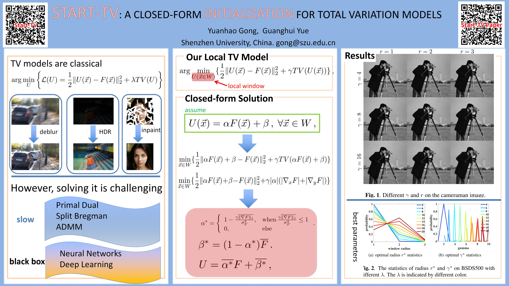

# Start-TV

## Total Variation Models are popular
They can be applied in various applications, such denoise, deblur, HDR and inpainting.
## Solving them are challenging
In general, there are two types of solvers. One is iterative methods and the other is the deep neural networks. The iterative methods can achieve the **optimal solutions**, but are computationally **slow**. On the other hand, the deep learning methods are fast, but can **not** guarentee to obtain the optimal solution.
## Our Local TV Models
We propose a **novel local model**. We restrict the TV model in a local window. As a result, the model does not have global dependency. Moreover, we introduce a local linear relationship between the output and the input. So, the model has a $\textcolor{red}{closed-form}$ $\textcolor{red}{solution}$.  
1. The filter is fast and can be easily implemented.
2. The filter with proper parameters can approxiamte the optimal solution from the global TV models.
3. The filter can preserve edges during the smoothing.

[paper link](https://ieeexplore.ieee.org/abstract/document/10647971)
